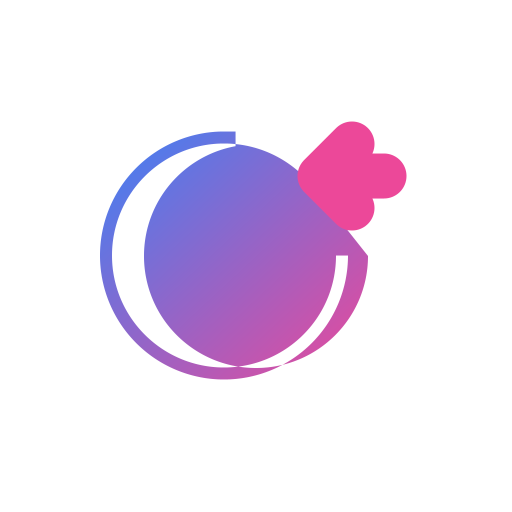

<div align="center">
  
  <h1 style="border-bottom: none; font-size: 3rem; background: linear-gradient(90deg, #A855F7, #EC4899, #F59E0B); -webkit-background-clip: text; -webkit-text-fill-color: transparent; font-weight: 900; margin-bottom: 0.5rem;">THE RESUME HUB</h1>
  <p style="font-size: 1.25rem; color: #6B7280; font-weight: 500;">Next-Gen AI Career Acceleration Platform</p>
  
  <div style="display: flex; gap: 10px; justify-content: center; margin-top: 1rem;">
    
    
    
    
  </div>
</div>

<br />

<div style="padding: 2.5rem; border-radius: 2rem; background: linear-gradient(135deg, rgba(168, 85, 247, 0.1), rgba(236, 72, 153, 0.1)); border: 1px solid rgba(168, 85, 247, 0.2); margin-bottom: 2rem;">
  <h2 style="color: #9333EA; margin-top: 0;">🚀 Project Vision</h2>
  <p style="font-size: 1.1rem; line-height: 1.6; color: #374151;">
    <b>The Resume Hub</b> is a premium AI-driven environment that empowers job seekers with "Liquid Glass" aesthetics and state-of-the-art career tools. From ATS-optimized resumes to real-time voice interview simulation, we bridge the gap between where you are and where you want to be.
  </p>
</div>

<div style="display: grid; grid-template-columns: repeat(auto-fit, minmax(300px, 1fr)); gap: 1.5rem; margin-bottom: 2rem;">
  <!-- Tech Stack Card -->
  <div style="padding: 2rem; border-radius: 1.5rem; background: #ffffff; border: 1px solid #E5E7EB; box-shadow: 0 10px 15px -3px rgba(0, 0, 0, 0.1);">
    <h3 style="color: #7C3AED; display: flex; align-items: center; gap: 10px; margin-top: 0;">🛠️ Tech Stack</h3>
    <ul style="list-style: none; padding-left: 0; color: #4B5563;">
      <li style="margin-bottom: 10px;"><b>• Core:</b> Next.js 14 (App Router), React 18</li>
      <li style="margin-bottom: 10px;"><b>• Language:</b> TypeScript (Strict Typing)</li>
      <li style="margin-bottom: 10px;"><b>• Styling:</b> Tailwind CSS & Liquid Glass UI</li>
      <li style="margin-bottom: 10px;"><b>• Auth:</b> Clerk (Enterprise Grade)</li>
      <li style="margin-bottom: 10px;"><b>• Icons:</b> Lucide React</li>
    </ul>
  </div>

  <!-- Major Highlights Card -->
  <div style="padding: 2rem; border-radius: 1.5rem; background: #ffffff; border: 1px solid #E5E7EB; box-shadow: 0 10px 15px -3px rgba(0, 0, 0, 0.1);">
    <h3 style="color: #DB2777; display: flex; align-items: center; gap: 10px; margin-top: 0;">⭐ Major Highlights</h3>
    <ul style="list-style: none; padding-left: 0; color: #4B5563;">
      <li style="margin-bottom: 10px;"><b>• AI Interviewer:</b> Real-time voice/text simulation</li>
      <li style="margin-bottom: 10px;"><b>• Resume Suite:</b> Deep analysis and auto-enhancement</li>
      <li style="margin-bottom: 10px;"><b>• Skill Assessment:</b> Adaptive AI-generated quizzes</li>
      <li style="margin-bottom: 10px;"><b>• Career GPS:</b> Dynamic gap-analysis & roadmaps</li>
      <li style="margin-bottom: 10px;"><b>• Market Data:</b> Real-time salary & growth outlook</li>
    </ul>
  </div>
</div>

<div style="padding: 2.5rem; border-radius: 2rem; background: #111827; color: white;">
  <h2 style="color: #60A5FA; margin-top: 0; text-align: center; margin-bottom: 2rem;">🔄 Application Workflow</h2>
  
  <div style="display: flex; flex-direction: column; gap: 1rem; max-width: 600px; margin: 0 auto;">
    <div style="display: flex; align-items: center; gap: 1.5rem; padding: 1rem; border-radius: 1rem; background: rgba(255,255,255,0.05); border-left: 4px solid #F59E0B;">
      <div style="font-size: 1.5rem; font-weight: 800; color: #F59E0B;">01</div>
      <div><b>Authentication:</b> Secure Login/Reset via Clerk Provider</div>
    </div>
    
    <div style="text-align: center; color: rgba(255,255,255,0.2);">↓</div>

    <div style="display: flex; align-items: center; gap: 1.5rem; padding: 1rem; border-radius: 1rem; background: rgba(255,255,255,0.05); border-left: 4px solid #EF4444;">
      <div style="font-size: 1.5rem; font-weight: 800; color: #EF4444;">02</div>
      <div><b>Dashboard:</b> View active stats, profile score, and job match alerts</div>
    </div>

    <div style="text-align: center; color: rgba(255,255,255,0.2);">↓</div>

    <div style="display: flex; align-items: center; gap: 1.5rem; padding: 1rem; border-radius: 1rem; background: rgba(255,255,255,0.05); border-left: 4px solid #EC4899;">
      <div style="font-size: 1.5rem; font-weight: 800; color: #EC4899;">03</div>
      <div><b>Analysis:</b> Upload resume for deep AI scoring & keyword gap analysis</div>
    </div>

    <div style="text-align: center; color: rgba(255,255,255,0.2);">↓</div>

    <div style="display: flex; align-items: center; gap: 1.5rem; padding: 1rem; border-radius: 1rem; background: rgba(255,255,255,0.05); border-left: 4px solid #A855F7;">
      <div style="font-size: 1.5rem; font-weight: 800; color: #A855F7;">04</div>
      <div><b>Practice:</b> Engage with AI Mock Interviewer or technical skill quizzes</div>
    </div>

    <div style="text-align: center; color: rgba(255,255,255,0.2);">↓</div>

    <div style="display: flex; align-items: center; gap: 1.5rem; padding: 1rem; border-radius: 1rem; background: rgba(255,255,255,0.05); border-left: 4px solid #3B82F6;">
      <div style="font-size: 1.5rem; font-weight: 800; color: #3B82F6;">05</div>
      <div><b>GPS Roadmap:</b> Generate time-bound learning plan to bridge skill gaps</div>
    </div>
  </div>
  
  <p style="text-align: center; margin-top: 3rem; color: rgba(255,255,255,0.4); font-size: 0.9rem;">
    Designed and Developed for the Hackathon Evolution 2026.
  </p>
</div>

<br />

## 🛠️ Getting Started

First, run the development server:

```bash
npm run dev
```

Open [http://localhost:3000](http://localhost:3000) to view your premium career hub.
